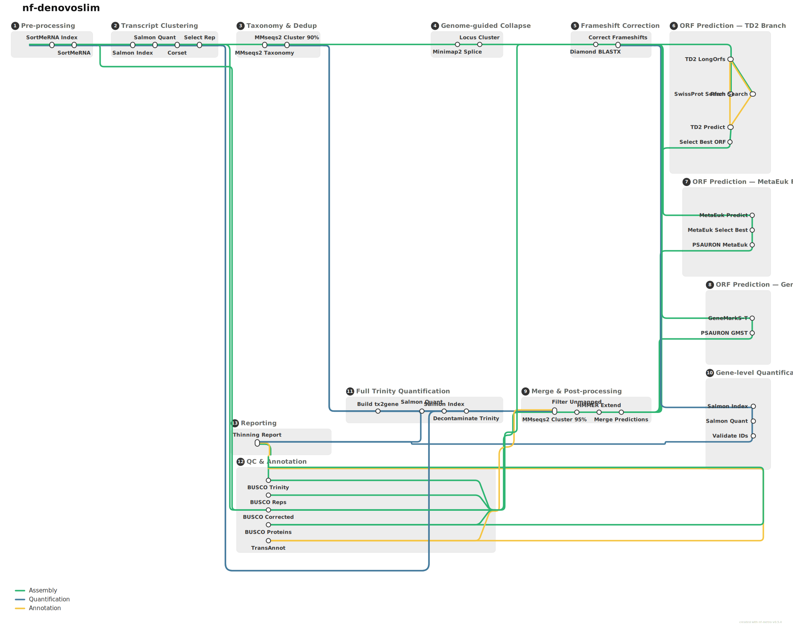

# nf-denovoslim

Nextflow DSL2 pipeline that collapses a fragmented Trinity *de novo* transcriptome assembly into a non-redundant gene set with one protein per gene.

## Overview

Given a Trinity assembly and paired-end RNA-seq reads, the pipeline produces:

- **SuperTranscript FASTA** — one consensus sequence per gene
- **Protein FASTA** (`.faa`) — one best protein per gene
- **GFF3** — ORF coordinates on SuperTranscripts
- **Gene-level Salmon quantification** — `quant.sf` with IDs matching the `.faa`
- **Functional annotation** — SwissProt + Pfam + eggNOG via TransAnnot
- **Dual BUSCO assessment** — Trinity baseline (transcriptome mode) + final proteins (protein mode)

### Design rationale

The **full, unfiltered Trinity assembly** goes directly into Salmon (with `--dumpEq`, no `--hardFilter`) so that multi-mapping signal across isoforms is preserved for Corset's hierarchical clustering. Deduplicating transcripts *before* Corset destroys this signal and produces mostly singleton clusters.

## Pipeline

<picture>
  
</picture>

Three routes through the pipeline: **Assembly** (green) follows the main processing chain, **Quantification** (blue) forks after frameshift correction to re-quantify SuperTranscripts with Salmon, and **Annotation** (gold) branches from the best-ORF selection to TransAnnot. **BUSCO Trinity** runs independently on the raw Trinity assembly as a baseline QC check.

| Step | Process | Tool |
|------|---------|------|
| 0 | rRNA filtering | SortMeRNA 4.3.7 |
| 1 | Initial quantification (full Trinity, `--dumpEq`) | Salmon 1.10.3 |
| 2 | Transcript-to-gene clustering | Corset 1.10 ([paliocha/Corset](https://github.com/paliocha/Corset)) |
| 3 | Build SuperTranscripts | [Lace 2.0.0](https://github.com/paliocha/Lace) |
| 4 | Taxonomy filter (keep Viridiplantae) | MMseqs2 taxonomy |
| 5 | Frameshift correction | Diamond blastx 2.1.22 |
| 6 | ORF prediction with homology support | TD2 + MMseqs2 (SwissProt, Pfam) |
| 7 | Best ORF selection (PSAURON FDR) | Python/BioPython |
| 8 | Gene-level quantification | Salmon 1.10.3 |
| 9 | Protein completeness | BUSCO v6 (protein mode) |
| 10 | Trinity completeness (parallel) | BUSCO v6 (transcriptome mode) |
| 11 | Functional annotation | TransAnnot 4.0.0 |
| 12 | Summary report | Python |

## Requirements

- [Nextflow](https://www.nextflow.io/) >= 23.04
- [Apptainer](https://apptainer.org/) (or Singularity / Docker)
- Pre-built MMseqs2 databases: SwissProt, Pfam, eggNOG7, UniRef50 taxonomy
- Diamond database: UniRef50 (for frameshift correction)
- eggNOG annotation TSV (for TransAnnot)
- Local containers: `containers/td2/td2_1.0.8.sif`, `containers/lace/lace_2.0.sif`

## Usage

```bash
nextflow run main.nf \
    -profile apptainer,slurm \
    --trinity_fasta /path/to/Trinity.fasta \
    --samplesheet samples.csv \
    --species_label SPECIES \
    --mmseqs2_swissprot /path/to/SwissProtDB \
    --mmseqs2_pfam /path/to/PfamDB \
    --mmseqs2_eggnog /path/to/eggNOG7DB \
    --mmseqs2_taxonomy_db /path/to/UniRef50taxdb \
    --diamond_db /path/to/uniref50.dmnd \
    --eggnog_annotations /path/to/eggnog_annotations.tsv \
    --busco_lineage poales_odb12 \
    --outdir /path/to/results
```

On NMBU Orion, use `-profile apptainer,orion` — database paths are pre-configured in `conf/orion.config`.

### Samplesheet format

```csv
sample,fastq_1,fastq_2,strandedness,condition
SPECIES01_T1_L,/path/to/R1.fq.gz,/path/to/R2.fq.gz,unstranded,T1_L
```

The `condition` column is optional. If omitted, condition is extracted from the sample name as `{Timepoint}_{Tissue}` (last two `_`-separated fields).

### Profiles

| Profile | Description |
|---------|-------------|
| `apptainer` | Apptainer containers |
| `singularity` | Singularity containers |
| `docker` | Docker containers |
| `slurm` | Generic SLURM scheduling |
| `orion` | NMBU Orion HPC (DB paths, SLURM queue, bind mounts, group quota fix) |
| `highmem` | 32 CPUs / 1200 GB RAM cap |
| `standard` | 16 CPUs / 128 GB RAM cap (default) |
| `test` | 4 CPUs / 16 GB RAM cap |

Combine as needed: `-profile apptainer,orion` or `-profile apptainer,slurm,highmem`.

### Parameters

| Parameter | Default | Description |
|-----------|---------|-------------|
| `--trinity_fasta` | required | Trinity assembly FASTA |
| `--samplesheet` | required | CSV samplesheet |
| `--species_label` | `species_X` | Output file prefix |
| `--mmseqs2_swissprot` | required | MMseqs2 SwissProt DB |
| `--mmseqs2_pfam` | required | MMseqs2 Pfam DB |
| `--mmseqs2_eggnog` | required | MMseqs2 eggNOG7 profiles DB |
| `--mmseqs2_taxonomy_db` | required | MMseqs2 UniRef50 taxonomy DB |
| `--diamond_db` | required | Diamond UniRef50 DB |
| `--eggnog_annotations` | required | eggNOG annotation TSV |
| `--busco_lineage` | required | BUSCO lineage (e.g. `poales_odb12`) |
| `--filter_taxon` | `33090` | NCBI taxon ID to keep (Viridiplantae) |
| `--mmseqs2_search_sens` | `7.0` | MMseqs2 `-s` sensitivity |
| `--td2_min_orf_length` | `90` | Minimum ORF length (aa) |
| `--td2_strand_specific` | `true` | TD2 strand-specific mode |
| `--sortmerna_db_dir` | `null` | Pre-downloaded rRNA DB dir |
| `--unix_group` | `null` | Unix group for quota accounting |
| `--outdir` | `./results` | Output directory |

## Pre-building databases

```bash
# SwissProt
mmseqs databases UniProtKB/Swiss-Prot SwissProtDB tmp

# Pfam
mmseqs databases Pfam-A.full PfamDB tmp

# eggNOG7 profiles
mmseqs databases eggNOG eggNOG7DB tmp

# UniRef50 taxonomy + Diamond databases (downloads prerequisites, then builds)
sbatch scripts/download_uniref50.sh

# Or build individually (if prerequisites already downloaded):
#   sbatch scripts/build_uniref50_diamond.sh
#   sbatch scripts/build_uniref50_mmseqstaxdb.sh
```

## Building containers

**TD2:**
```bash
docker build -t td2:1.0.8 containers/td2/
docker save td2:1.0.8 -o td2.tar
apptainer build containers/td2/td2_1.0.8.sif docker-archive://td2.tar
```

**Lace** — download pre-built container from [paliocha/Lace releases](https://github.com/paliocha/Lace/releases):
```bash
wget -O containers/lace/lace_2.0.sif \
  https://github.com/paliocha/Lace/releases/download/v2.0.0/lace_2.0.sif
```

## Output

```
results/
├── clustering/
│   ├── corset-clusters.txt               # tx2gene mapping
│   └── corset-counts.txt                 # Gene-level raw counts
├── supertranscripts/
│   └── supertranscripts.fasta
├── taxonomy/
│   ├── taxRes_lca.tsv
│   ├── supertranscripts_filtered.fasta
│   ├── taxonomy_filter_stats.txt
│   └── taxonomy_breakdown.tsv
├── frameshift_correction/
│   └── frameshift_stats.txt
├── mmseqs2_search/
│   ├── swissprot_alnRes.m8
│   └── pfam_alnRes.m8
├── proteins/
│   └── SPECIES.faa                       # One protein per gene
├── annotation/
│   ├── best_orfs.gff3
│   └── orf_to_gene_map.tsv
├── salmon_final/
│   └── {SAMPLE}_st_quant/quant.sf        # Gene-level quantification
├── qc/
│   ├── busco_trinity/                    # BUSCO transcriptome mode
│   └── busco_final/                      # BUSCO protein mode
├── transannot/
└── SPECIES_thinning_report.txt
```

Initial Salmon quant (used internally by Corset) and SortMeRNA filtered reads are not published.

## Using output with tximport

```r
library(tximport)
library(DESeq2)

files <- list.files("results/salmon_final", pattern = "quant.sf",
                     recursive = TRUE, full.names = TRUE)
names(files) <- gsub("_st_quant$", "", basename(dirname(files)))

# SuperTranscript = gene, so tx2gene is an identity mapping
tx2gene <- data.frame(
  TXNAME = read.delim(files[1])$Name,
  GENEID = read.delim(files[1])$Name
)

txi <- tximport(files, type = "salmon", tx2gene = tx2gene)
dds <- DESeqDataSetFromTximport(txi, colData = samples, design = ~ condition)
```

The Corset transcript-to-gene map is at `results/clustering/corset-clusters.txt` if transcript-level import is needed.

## Author

Martin Paliocha — [NMBU](https://www.nmbu.no/)
